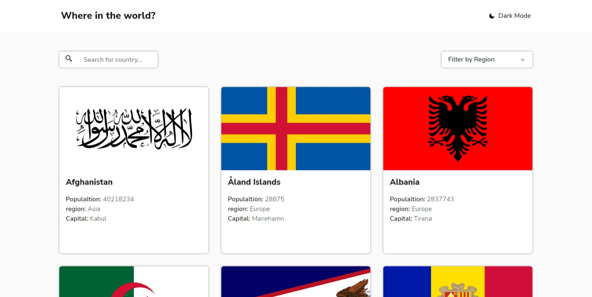

# Frontend Mentor - REST Countries API with color theme switcher solution

This is a solution to the [REST Countries API with color theme switcher challenge on Frontend Mentor](https://www.frontendmentor.io/challenges/rest-countries-api-with-color-theme-switcher-5cacc469fec04111f7b848ca). Frontend Mentor challenges help you improve your coding skills by building realistic projects.

### Screenshot

### Links

- Solution URL: [https://karimaoulallay.github.io/rest-countries-api](https://karimaoulallay.github.io/rest-countries-api/)

## My process

### Built with

- Semantic HTML5 markup
- TailwindCss
- Flexbox
- CSS Grid
- Mobile-first workflow
- [React](https://reactjs.org/) - JS library
- [Vite](https://vitejs.dev) - Build Tool

### What I learned

- Switch between Dark/Light mode with Tailwindcss.

### Useful resources

- [Scrimba react course](https://scrimba.com/learn/learnreact) - This is a very good course for react absolute beginners that helped me a lot on my react learning journey.
- [Scrimba react router 6 course](https://scrimba.com/learn/reactrouter6) - This is an amazing course which helped me learn react router. I'd recommend it to anyone still learning this concept.

## Author

- Frontend Mentor - (https://www.frontendmentor.io/profile/karimode)
- Twitter - (https://twitter.com/karim_aoulallay)
